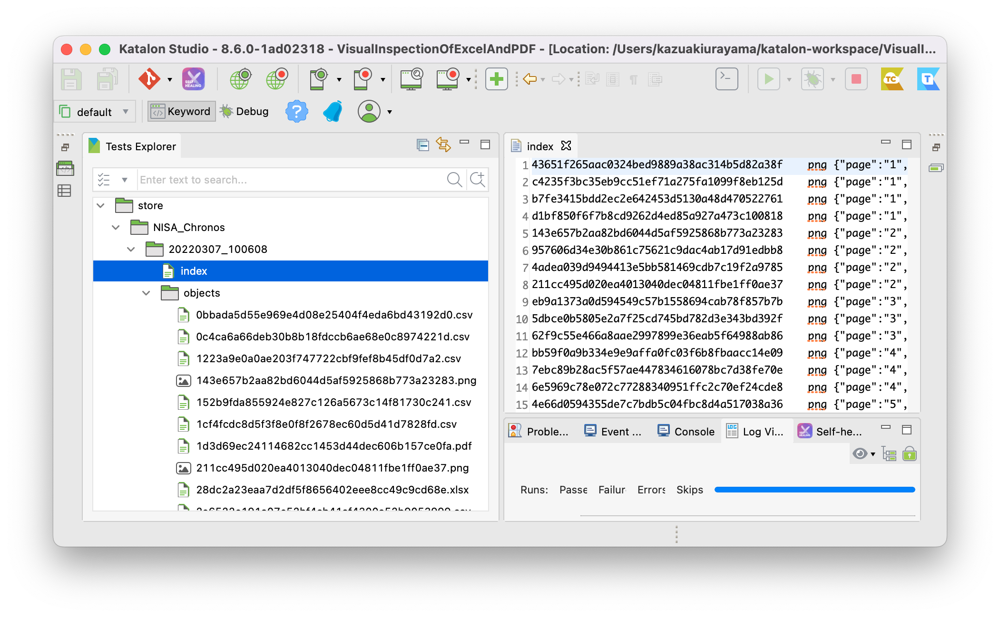
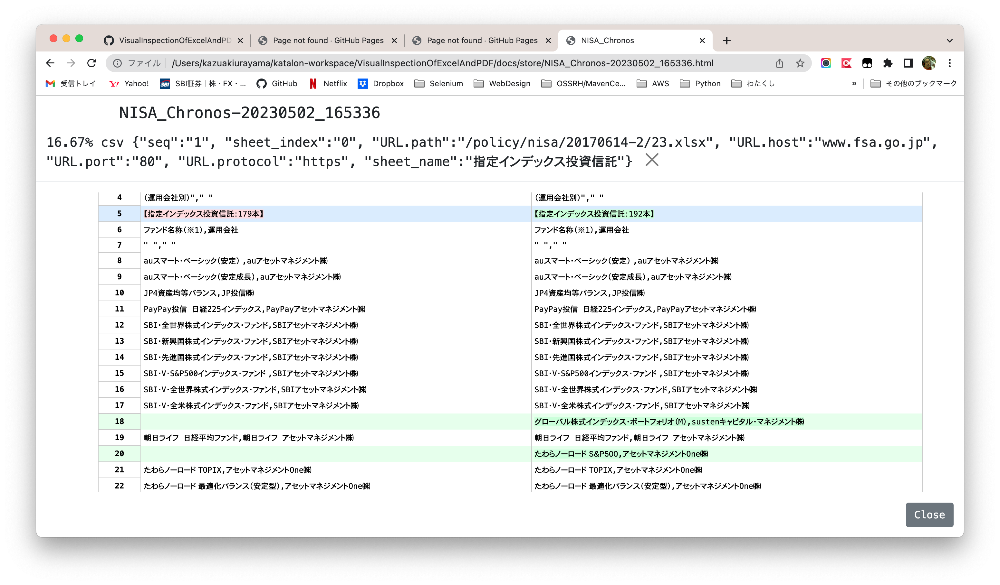
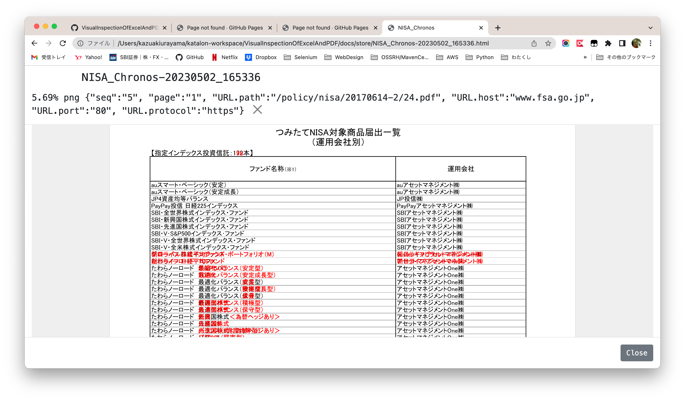

# Visual inspection of Excel and PDF

This is a [Katalon Studio](https://www.katalon.com/katalon-studio/) project for demonstration purpose. You can download a zip of this project at [Releases](https://github.com/kazurayam/VisualInspectionOfExcelAndPDF/releases/) page, unzip and open it in your local Katalon Studio.

This project was developed using Katalon Studio v0.8.2 (Free License). But it should work with any version of Katalon Studio.

## Motivation

A few years ago, I worked for a media company. I was asked to develop a tool software, which was a sort of web scraping tool. The target page was [this](https://www.fsa.go.jp/policy/nisa2/about/tsumitate/target/index.html); it is still available to public at April 2023. The page looks as follows:

You don’t need to understand Japanese in this page. Just note the following points.

1.  The page contains several links `<a href="…​">EXCEL</a>` to the URLs of Excel files. It contains links to PDF files `<a href="…​">PDF</a>` as well.

2.  The content of Excel & PDF files are updated by the publisher irregularly. The frequency of updates are not determined. By tracking the historical records, I see that updates are made once a month or per 2 months.

3.  The URL string of Excel/PDF files are fixed. The file names won’t change at updates.

4.  The publisher does not provide any push-style notification (like [RSS](https://en.wikipedia.org/wiki/RSS)) of this page. The publisher (fsa.go.jp) expects that those who are interested in the information of this page should repeat watching the page to find any updates when made.

5.  The company I worked for had a serious interest in the attached files. Therefore the company asked some employees to watch this page everyday. When they found any updates, they downloaded the PDF/Excel files and put them into further processing. Obviously this job was boring for human.

6.  The employees hated this job. They wanted some system that automates this bullshit job.

I worked out and got a solution. Let me describe it.

## Problem to solve

My solution should address the following problems:

1.  It visit the web page regularly and automatically; e.g, once a day and every business days.

2.  It should compare the content of PDF/Excel files visually:

    -   It should download the current version of .pdf and .xlsx files, compare the content with the previous version to find if there are any updates in the files.

    -   It should report the result of comparison in a human-readable format so that the staff can check what changes have occurred.

    -   It should store the latest version of .pdf and .xlsx files somewhere as backup. Later the software will refer to them as comparison basis.

3.  If any updates found, it should take some action. For example, transfer the files into some organizational file server and send some messages to those who are concerned via Message Queue or E-mail, Slack etc.

The 1st problem (running a process regularly and automatically) can be achieved by Linux [cron](https://en.wikipedia.org/wiki/Cron), Windows [Task Scheduler](https://docs.microsoft.com/en-us/windows/win32/taskschd/about-the-task-scheduler), or some Continuous Integration servers like [Jenkins](https://www.jenkins.io/).

The 3rd problem (taking some actions when your script find it necessary) will be solved by straight-forward custom programming. This would deserve another planning and efforts.

Here I will focus on the 2nd problem. How can my software compare 2 PDF/Excel files? How can it detect that the current file has been updated since the last? How can it present the difference between the current and previous version visible to human?

My demo project [Visual Inspection in Katalon Studio](https://forum.katalon.com/t/visual-inspection-in-katalon-studio-reborn/57440) enabled me to compare pairs of PNG images. And also it enabled me to compare pairs of text files regardless its semantic format --- HTML, XML, JSON, CSV, CSS, JS, etc. **However, `.xlsx` and `.pdf` are specially formatted binary files. Any binary files require application programs that recognizes its own unique file format. My classes in the "materialstore" library can not compare binary files.**

## Solution

I have developped a library [materialstore-mapper](https://github.com/kazurayam/materialstore-mapper) which extends the [materialstore](https://github.com/kazurayam/materialstore) library. It enables me to convert a Excel `.xlsx` file into a set of `.csv` files. It also enables me to convert a PDF `.pdf` file into a set of PNG images.

In [this project](https://github.com/kazurayam/VisualInspectionOfExcelAndPDF) I will show you an example of downloading the current set of Excel+PDF files and then compare them with the previous set.

For this project, I used a group of classes categorized as `"Mapper"`:

1.  [`Excel2CSVMapper`](https://github.com/kazurayam/materialstore-mapper/blob/master/src/main/java/com/kazurayam/materialstore/mapper/Excel2CSVMapperPOI3.java)

2.  [`PDF2ImageMapper`](https://github.com/kazurayam/materialstore-mapper/blob/master/src/main/java/com/kazurayam/materialstore/mapper/PDF2ImageMapper.java)

The framework [materialstore](https://github.com/kazurayam/materialstore/) will use those "Mapper" classes to convert a binary file into a text file. Once Excel file is converted into a CSV file, my Visual Inspection will happily compare the CSV files and compile a diff report. Once a PDF file is converted into PNG images, my Visual Inspection will happily process PNG files as well.

## Demonstration

Here I assume that

1.  You have downloaded the zip of this project from the [Releases](https://github.com/kazurayam/VisualInspectionOfExcelAndPDF/releases) page and unzipped it.

2.  You have the Java8 or newer installed.

3.  You have [Gradle](https://gradle.org/) installed.

If you don’t have Gradle in hand, please refer to [this guidance](https://forum.katalon.com/t/automated-visual-inspection/81966#setting-up-gradle-build-tool-22).

### Running the demonstration, step by step

#### Download external dependencies

In the command line, cd to the project root, and run:

    $ gradle drivers

    $ gradle copyKatalonDependencies

When done, you will see a lot of jar files are located in the `Drivers` directory of the project. These are the external dependencies required to run this project:

    $ ls Drivers
    AUTOIMPORTED_ExecutionProfilesLoader-1.2.1.jar          katalon_generated_jackson-dataformat-cbor-2.6.7.jar
    AUTOIMPORTED_ashot-1.5.4.jar                            katalon_generated_java-diff-utils-4.11.jar
    AUTOIMPORTED_commons-csv-1.9.0.jar                      katalon_generated_javassist-3.18.2-GA.jar
    AUTOIMPORTED_freemarker-2.3.31.jar                      katalon_generated_javax.activation-api-1.2.0.jar
    AUTOIMPORTED_inspectus-0.9.2.jar                        katalon_generated_jaxb-api-2.3.1.jar
    AUTOIMPORTED_java-diff-utils-4.11.jar                   katalon_generated_jcl-over-slf4j-1.7.5.jar
    AUTOIMPORTED_jsoup-1.14.3.jar                           katalon_generated_jdom2-2.0.6.1.jar
    AUTOIMPORTED_materialstore-0.16.2.jar                   katalon_generated_jmespath-java-1.11.232.jar
    katalon_generated_FontVerter-1.2.22.jar                 katalon_generated_jna-4.1.0.jar
    katalon_generated_annotations-2.0.1.jar                 katalon_generated_jna-platform-4.1.0.jar
    katalon_generated_ashot-1.5.4.jar                       katalon_generated_joda-time-2.8.1.jar
    katalon_generated_aws-java-sdk-core-1.11.232.jar        katalon_generated_jsoup-1.14.3.jar
    katalon_generated_aws-java-sdk-kms-1.11.232.jar         katalon_generated_jsr305-1.3.9.jar
    katalon_generated_aws-java-sdk-s3-1.11.232.jar          katalon_generated_materialstore-0.16.2.jar
    katalon_generated_cglib-nodep-2.1_3.jar                 katalon_generated_materialstore-mapper-0.10.2.jar
    katalon_generated_commons-codec-1.10.jar                katalon_generated_pdf2dom-2.0.1.jar
    katalon_generated_commons-collections4-4.1.jar          katalon_generated_pdfbox-2.0.26.jar
    katalon_generated_commons-csv-1.9.0.jar                 katalon_generated_pdfbox-debugger-2.0.26.jar
    katalon_generated_commons-exec-1.3.jar                  katalon_generated_pdfbox-tools-2.0.26.jar
    katalon_generated_commons-io-2.11.0.jar                 katalon_generated_poi-3.17.jar
    katalon_generated_commons-lang3-3.4.jar                 katalon_generated_poi-ooxml-3.17.jar
    katalon_generated_commons-logging-1.2.jar               katalon_generated_poi-ooxml-schemas-3.17.jar
    katalon_generated_curvesapi-1.04.jar                    katalon_generated_reflections-0.9.9.jar
    katalon_generated_fontbox-2.0.26.jar                    katalon_generated_rome-1.18.0.jar
    katalon_generated_freemarker-2.3.31.jar                 katalon_generated_rome-utils-1.18.0.jar
    katalon_generated_gson-2.8.2.jar                        katalon_generated_s3fs-2.2.2.jar
    katalon_generated_guava-19.0.jar                        katalon_generated_selenium-api-2.53.0.jar
    katalon_generated_hamcrest-core-1.3.jar                 katalon_generated_selenium-remote-driver-2.53.0.jar
    katalon_generated_httpclient-4.5.2.jar                  katalon_generated_slf4j-api-1.7.32.jar
    katalon_generated_httpcore-4.4.4.jar                    katalon_generated_stax-api-1.0.1.jar
    katalon_generated_ion-java-1.0.2.jar                    katalon_generated_subprocessj-0.3.4.jar
    katalon_generated_jackson-annotations-2.6.0.jar         katalon_generated_tika-core-1.5.jar
    katalon_generated_jackson-core-2.6.7.jar                katalon_generated_xmlbeans-2.6.0.jar
    katalon_generated_jackson-databind-2.6.7.1.jar

There are quite a lot. They are just used by my "materialstore" and "materialstore-mapper" library. You do not need to know these libraries.

#### Setting up the fixture data

Start Katalon Studio. Open the project and run the Test Case script [Test Cases/NISA/setupFixture](https://github.com/kazurayam/VisualInspectionOfExcelAndPDF/blob/develop/Scripts/NISA/setupFixture/Script1683011128442.groovy). It will take a few minuites to finish.

By this, a directory `store/NISA_Chronos_20220307_100608` will be created. In there you will find a lot of files prepared, which includes .xlsx, .pdf, .csv and .png. These files are prepared to reproduce an environment as if you ran the task at 10:06 AM, 7th of March, 2022.

#### Running the Test Case "NISA/main\_Chronos"

Now you are ready to run the demo. Open the following Test Case and run it.

-   [Test Cases/NISA/main\_Chronos](https://github.com/kazurayam/VisualInspectionOfExcelAndPDF/blob/develop/Scripts/NISA/main_Chronos/Script1682593110094.groovy)

It will take a few minutes to finish.

When finished, you will find an HTML is generated

-   [&lt;projectDir&gt;/store/NISA\_Chronos/index.html](https://kazurayam.github.io/VisualInspectionOfExcelAndPDF-sample-project/store/index.html)
    ./
    Please open this link in browser and have a look around. You will find some "diff" information as follows. They look useful, don’t they?./

