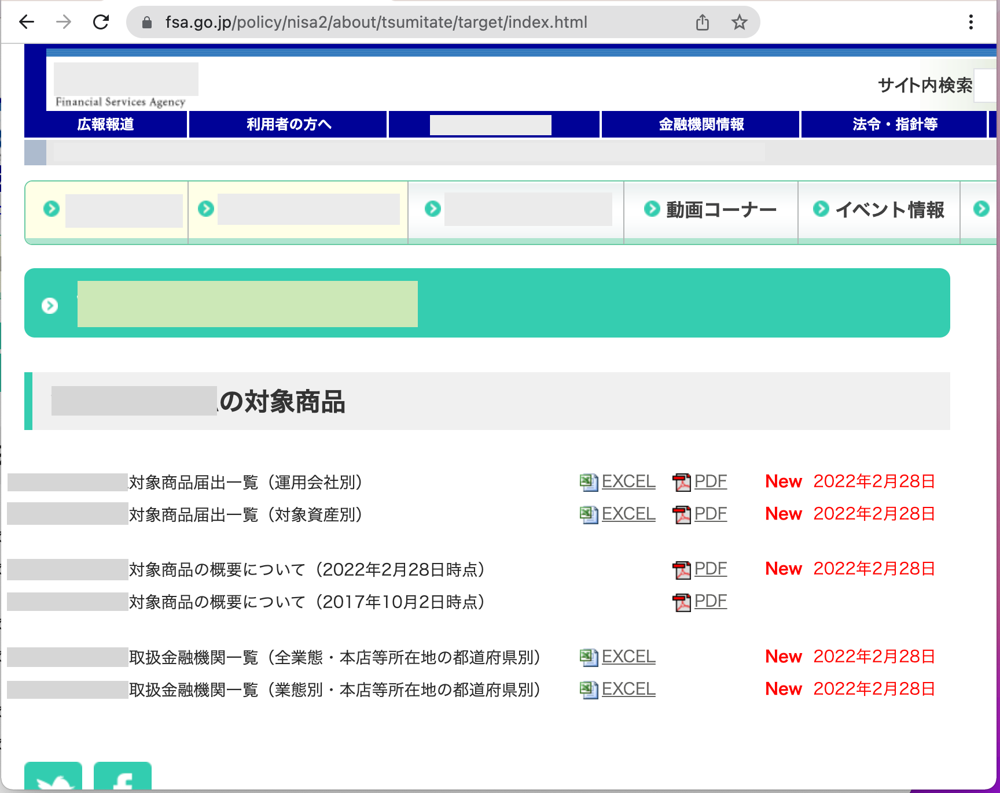
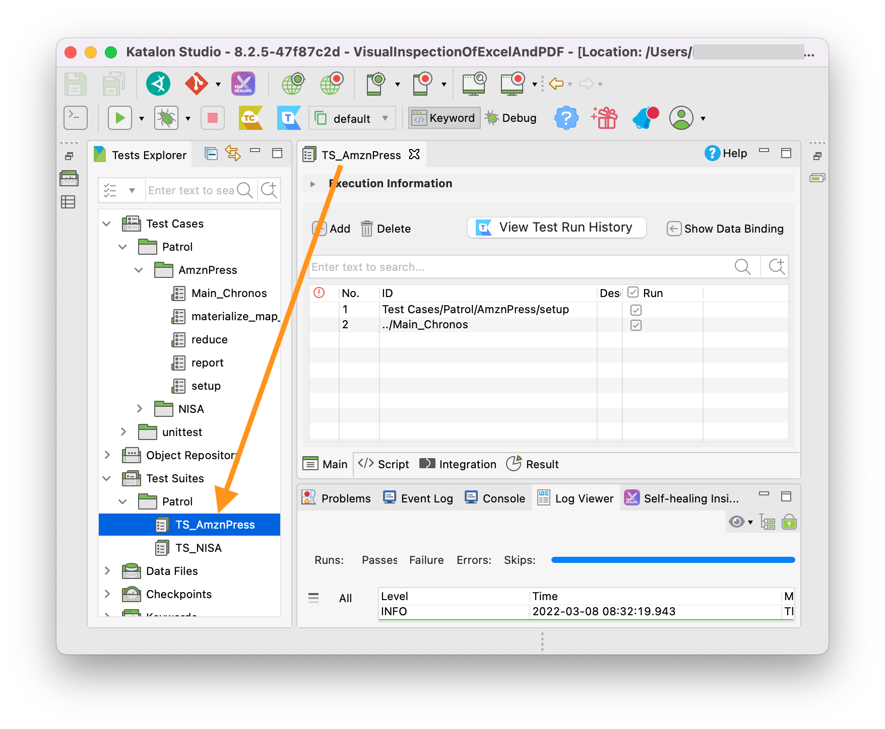
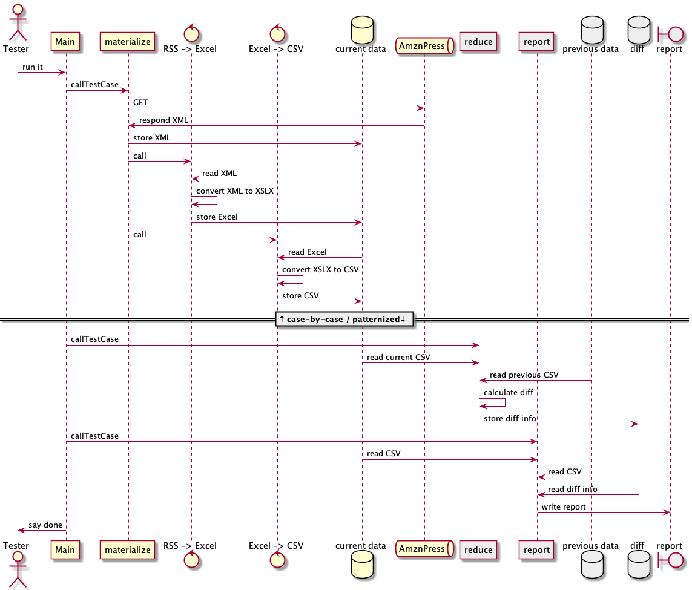
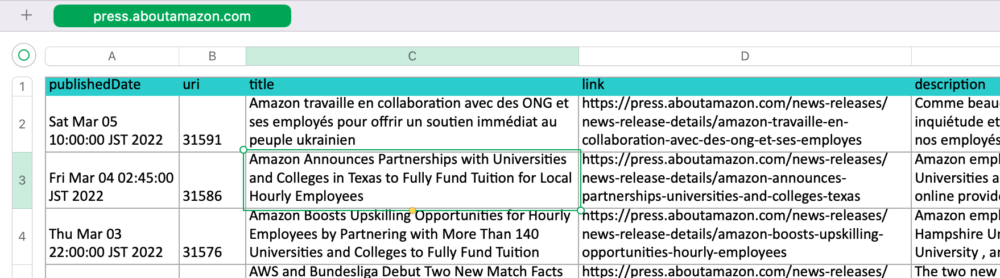
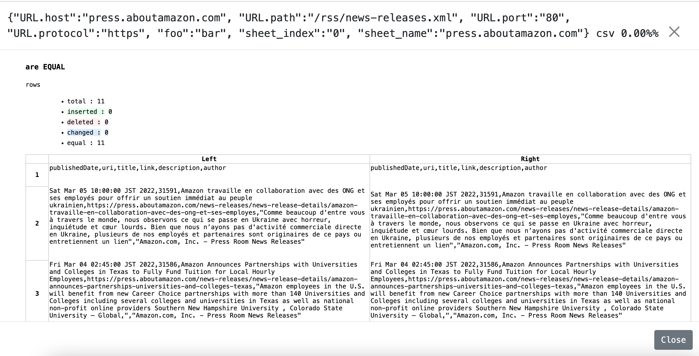

# Visual inspection of Excel and PDF

This is a [Katalon Studio](https://www.katalon.com/katalon-studio/) project for demonstration purpose. You can download a zip of this project at [Releases](https://github.com/kazurayam/VisualInspectionOfExcelAndPDF/releases/tag/0.2.0) page, unzip and open your local Katalon Studio.

This project was developed using Katalon Studio v0.8.2 (Free License). But it should work with any version of KS as it uses only the stable parts of KS.

## Motivation

A few years ago, I worked for a media company. I was asked to develop a tool software, which is a sort of web scraping tool. The target page was [this](https://www.fsa.go.jp/policy/nisa2/about/tsumitate/target/index.html) (is still available to public at MAR 2022). The page looks as follows:

You don’t need to understand this page in detail except the following points.

1.  The page contains several links `<a href="…​">EXCEL</a>` tags to the URLs of Excel files. It contains links to PDF files `<a href="…​">PDF</a>` as well.

2.  The content of Excel & PDF files are updated by the publisher irregularly. The frequency of updates are not determined. By tracking the record, I see once a month, or once per 2 months.

3.  The URL string of Excel/PDF files are fixed. The file names won’t change at updates.

4.  The publisher does not provide any push-style notification (like [RSS](https://en.wikipedia.org/wiki/RSS)) for this page. The publisher supposed that those who are interested in the information of this page should continue watching the page everyday.

5.  The company I worked for had a serious interest in the Excel files. Some employees were asked to visit this page everyday. They were asked, when found updates, to trigger a series of actions to digest the Excel files.

6.  The employees hated this job. They wanted some system to automate this bullshit job.

Since then I worked long to solve this problem. Finally I have got a solution. Let me describe it.

## Problem to solve

My solution should:

1.  visit the web page regularly and automatically, for example once a day

2.  compare the content of Excel files visually:

    -   download the current version of .xlsx files, compare the content with some version to find if any updates there are.

    -   report the result of comparison in a human-readable format so that the staff can check what occured.

    -   store the previous versions of .xlsx file somewhere so that the software can compare the current one against.

3.  If any updates found, take some action. For example, transfer the .xlsx files into some organizational file server and send some notification to those who are concerned: send messages to MQ and E-mail etc.

The 1st problem (running a process regularly and automatically) will be implemented using Linux [cron](https://en.wikipedia.org/wiki/Cron), Windows [Task Scheduler](https://docs.microsoft.com/en-us/windows/win32/taskschd/about-the-task-scheduler), and some Continuous Integration servers like [Team City](https://www.jetbrains.com/teamcity/). Katalon offers [Test Ops](https://www.katalon.com/testops/) of course.

The 3rd problem (taking some actions when your script find it necessary) will be solved by straight-forward custom programming. This would deserve another planning and efforts.

Here I will focus on the 2nd problem. How can my software compare 2 Excel files? How can it detect that the current Excel is updated since the last? How can it present the difference between the current and previous Excel files? My [Visual Inspection in Katalon Studio](https://forum.katalon.com/t/visual-inspection-in-katalon-studio-reborn/57440) showed that my product is capable of comparing pairs of PNG images and pairs of text files regardless its format --- HTML, XML, JSON, CSV, CSS, JS, etc.

**However, `.xlsx` and `.pdf` are binary files. Any binary files require some application programs that recognizes its internal file format. My text differ module in the "materialstore" library can not deal with those binary files.**

## Solution

In [this project](https://github.com/kazurayam/VisualInspectionOfExcelAndPDF) I will show you a example of comparing 2 Excel files --- chronologically previous one and current one.

For this project, I developed a group of classes categorized as `"Mapper"`:

-   [materialstore-mapper](https://github.com/kazurayam/materialstore-mapper/)

The current "Mapper"s includes the following:

1.  [`Excel2CSVMapper`](https://github.com/kazurayam/materialstore-mapper/blob/master/src/main/java/com/kazurayam/materialstore/mapper/Excel2CSVMapperPOI3.java)

2.  [`PDF2ImageMapper`](https://github.com/kazurayam/materialstore-mapper/blob/master/src/main/java/com/kazurayam/materialstore/mapper/PDF2ImageMapper.java)

3.  [`PDF2HTMLMapper`](https://github.com/kazurayam/materialstore-mapper/blob/master/src/main/java/com/kazurayam/materialstore/mapper/PDF2HTMLMapper.java)

4.  [`RSSAmznPress2ExcelMapper`](https://github.com/kazurayam/materialstore-mapper/blob/master/src/main/java/com/kazurayam/materialstore/mapper/RSSAmznPress2ExcelMapper.java)

"Mapper"s will be driven by the framework of

-   <https://github.com/kazurayam/materialstore/>

## Description

### Target Application Under Test

I won’t use [this page](https://www.fsa.go.jp/policy/nisa2/about/tsumitate/target/index.html) as the testbed for demonstration, because

1.  this page is not updated frequent enough. It will be updated only once per a month at most. I want a URL as testbed which is updated more frequently; I want once per 1 or 2 days.

2.  this page is owned by a governmental organization of JP. I do not like bothering them.

Instead I would use the following URL as the testbed for my demonstration:

-   [Amazon.com, Inc. - Press Room News Releases](https://press.aboutamazon.com/rss/news-releases.xml)

This URL provides a RSS feed in XML format, is updated more frequently (several times on Wed, Thu, Fri). And I believe that the publisher would not stop me accessing it using my automated software.

## Demonstration

### How to activate the demo

open the Test Suite `"Test Suite/Patrol/TS_AmznPress"` and run it.

### Sequence diagram

The following diagram illustrates the process sequence of [Test Case/main/AmznPress/Main\_Chronos](./Scripts/main/AmznPress/Main_Chronos/Script1646628040145.groovy)

### How the data is transformed step-by-step

The sole input is the RSS document published by Amazon.com. The contents will change day by day. A snapshot looks like this:

-   [Example RSS](https://kazurayam.github.io/VisualInspectionOfExcelAndPDF/store/AmznPress/20220307_100304/objects/a9eec8a161f8600ac3bd9661bf0f561819c2fbe0.xml)

<!-- -->

    <rss xmlns:dc="http://purl.org/dc/elements/1.1/" version="2.0" xml:base="https://press.aboutamazon.com/">
      <channel>
        <title>Amazon.com, Inc. - Press Room News Releases</title>
        <link>https://press.aboutamazon.com/</link>
        <description>Amazon.com, Inc. - Press Room News Releases</description>
        <language>en</language>
        ...
        <item>
          <title>Amazon Announces Partnerships with Universities and Colleges in Texas to Fully Fund Tuition for Local Hourly Employees</title>
          <link>https://press.aboutamazon.com/news-releases/news-release-details/amazon-announces-partnerships-universities-and-colleges-texas</link>
          <description>Amazon employees in the U.S. will benefit from new Career Choice partnerships with more than 140 Universities and Colleges including several colleges and universities in Texas as well as national non-profit online providers Southern New Hampshire University , Colorado State University – Global,</description>
          <pubDate>Thu, 03 Mar 2022 12:45:00 -0500</pubDate>
          <dc:creator>Amazon.com, Inc. - Press Room News Releases</dc:creator>
          <guid isPermaLink="false">31586</guid>
        </item>
        ...

This RSS XML document will be internally converted into an Excel xlsx file, like this

And then the Excel file will be converted into a CSV text file, like this

-   [Example CSV](https://kazurayam.github.io/VisualInspectionOfExcelAndPDF/store/AmznPress/20220307_100304/objects/ff3a8a1f014bc640ac3346f98a26bd9f74a8f7a1.csv)

<!-- -->

    publishedDate,uri,title,link,description,author
    Sat Mar 05 10:00:00 JST 2022,31591,Amazon travaille en collaboration avec des ONG et ses employés pour offrir un soutien immédiat au peuple ukrainien,https://press.aboutamazon.com/news-releases/news-release-details/amazon-travaille-en-collaboration-avec-des-ong-et-ses-employes,"Comme beaucoup d'entre vous à travers le monde, nous observons ce qui se passe en Ukraine avec horreur, inquiétude et cœur lourds. Bien que nous n’ayons pas d'activité commerciale directe en Ukraine, plusieurs de nos employés et partenaires sont originaires de ce pays ou entretiennent un lien","Amazon.com, Inc. - Press Room News Releases"
    Fri Mar 04 02:45:00 JST 2022,31586,Amazon Announces Partnerships with Universities and Colleges in Texas to Fully Fund Tuition for Local Hourly Employees,https://press.aboutamazon.com/news-releases/news-release-details/amazon-announces-partnerships-universities-and-colleges-texas,"Amazon employees in the U.S. will benefit from new Career Choice partnerships with more than 140 Universities and Colleges including several colleges and universities in Texas as well as national non-profit online providers Southern New Hampshire University , Colorado State University – Global,","Amazon.com, Inc. - Press Room News Releases"
    ...

### Report

The `Test Suites/Patrol/TS_AmznPress` will eventually generate a report in HTML format. In this report you can see the result of visual comparison of 2 CSV files, which is equal to the comparison of 2 Excel files.

-   [store/AmznPress-index.html](https://kazurayam.github.io/VisualInspectionOfExcelAndPDF/store/AmznPress-index.html)

## How the test script is written

### Main script

The `AmznPress/Main_Chronos` script is the entry point of overall processing.

-   [`Test Cases/Patrol/AmznPress/Main_Chronos`](https://github.com/kazurayam/VisualInspectionOfExcelAndPDF/blob/master/Scripts/Patrol/AmznPress/Main_Chronos/Script1646657325745.groovy)

It drives sub modules, which includes broadly 4 stages of processing.

1.  **Materialize stage**

2.  **Map stage**

3.  **Reduce stage**

4.  **Report stage**

The script as "Materialize state" will get access to the target URL, download the web resources (e.g, RSS XML file), save it into the "store" directory on disk. The files stored in the "store" is called "Material".

The script as "Map stage" will read a Material from the store, and write back a Material into the store. It will carry out a series of format conversion. E.g, RSS XML to Excel, Excel to CSV, PDF to PNG image, PDF to HTML.

It is likely the case that a single script processes both of "Materialize stage" and "Map stage" sequentially. Also it is likely the case that a single script processes multiple source URLs and iterate over them.

The "Materialize stage" and "Map stage" is heavily dependent on each use cases. You are supposed to design these stages and implement them for yourself.

The "Reduce stage" will construct 2 sets of "MaterialList" = list of files to compare. And it will compare the pairs of Materials to generate the diff information.

The "Report stage" will compile a report of comparison result.

The "Reduce stage" and "Report stage" of the sample are highly modularized, and possibly you would just reuse the sample script. It should work for you.

### Sub modules

-   [Test Cases/Patrol/AmznPress/materialize\_map\_map](https://github.com/kazurayam/VisualInspectionOfExcelAndPDF/blob/master/Scripts/Patrol/AmznPress/materialize_map_map/Script1646657325735.groovy)

-   [Test Cases/Patrol/AmznPress/reduce](https://github.com/kazurayam/VisualInspectionOfExcelAndPDF/blob/master/Scripts/Patrol/AmznPress/reduce/Script1646657325740.groovy)

-   [Test Cases/Patrol/AmznPress/report](https://github.com/kazurayam/VisualInspectionOfExcelAndPDF/blob/master/Scripts/Patrol/AmznPress/report/Script1646657325749.groovy)

## Conclusion

The employee of the company which I worked for a few years ago required a software tool that could automate visiting [this](https://www.fsa.go.jp/policy/nisa2/about/tsumitate/target/index.html) URL, check if the Excel files are updated or not, and if any changes are found, fire some data processing action. I would name this type of tool as **Patrol**. Now I am ready to build a Patrol for them. However I have already finished working with them. I do not have chance to help them any longer. I hope someone in the company find my development and apply it to help the employees who are engaged in the bullshit jobs.

## Appendix

-   <https://kazurayam.github.io/VisualInspectionOfExcelAndPDF/>
